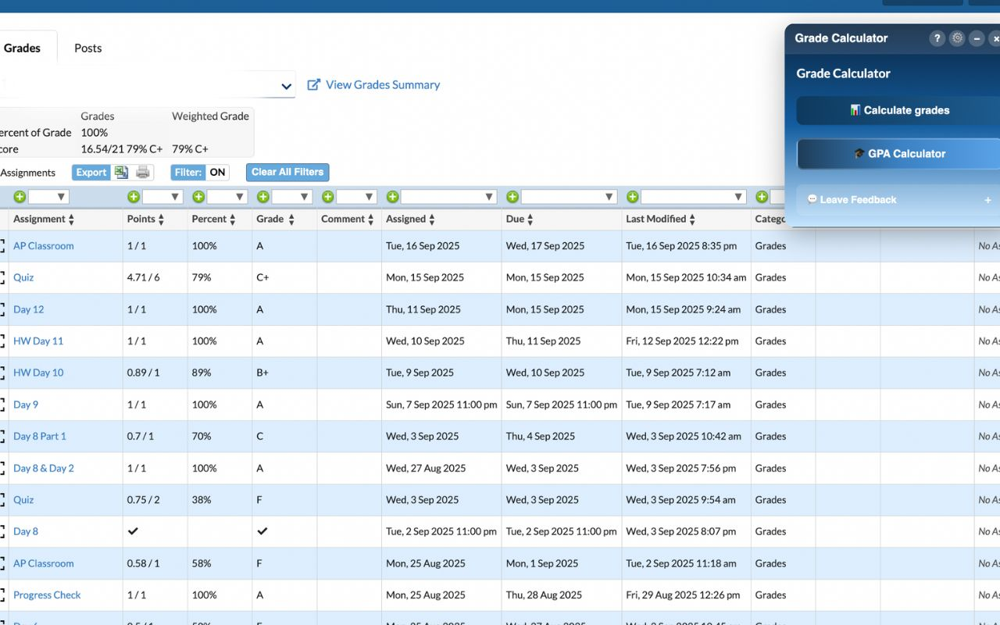
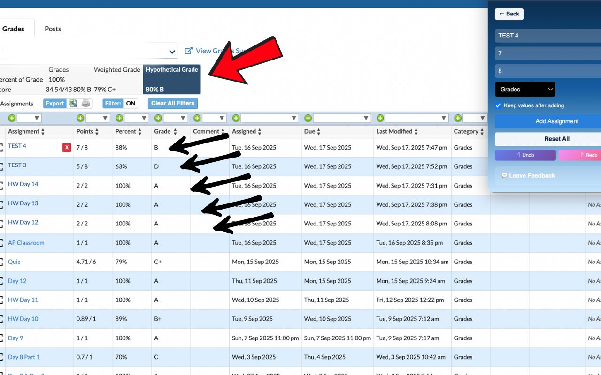
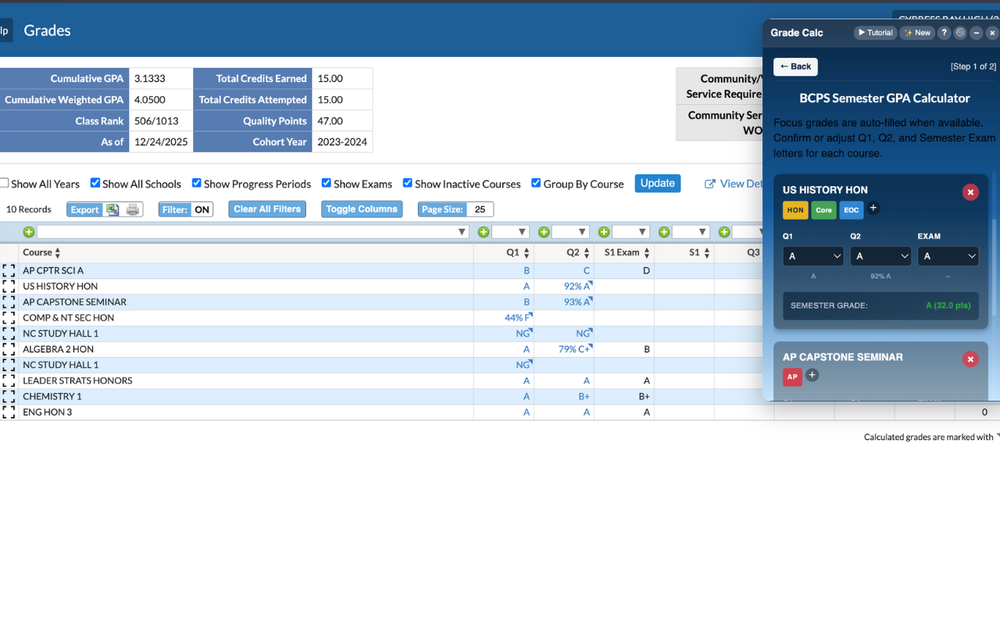
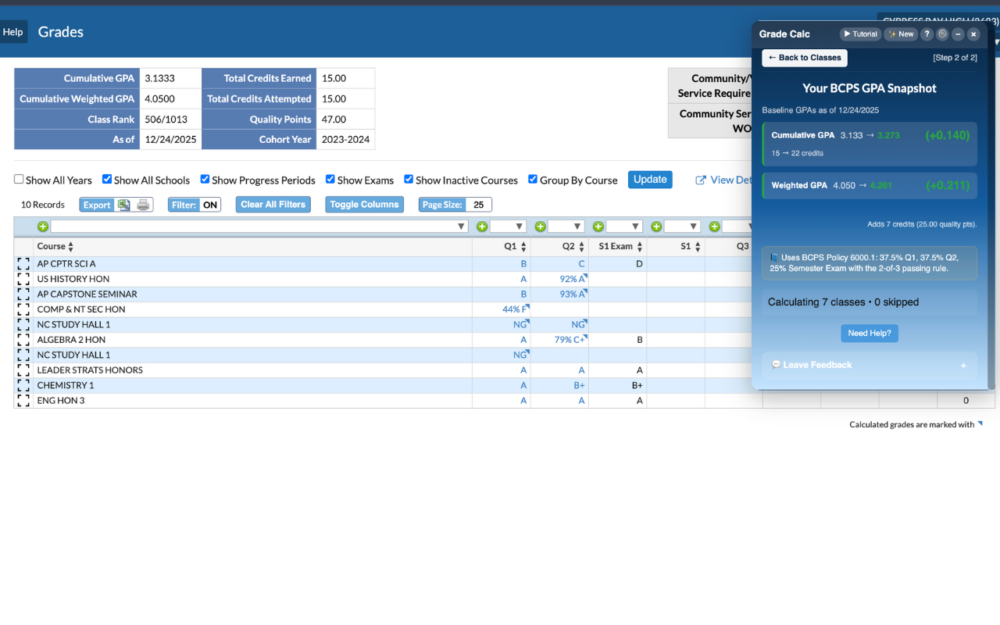
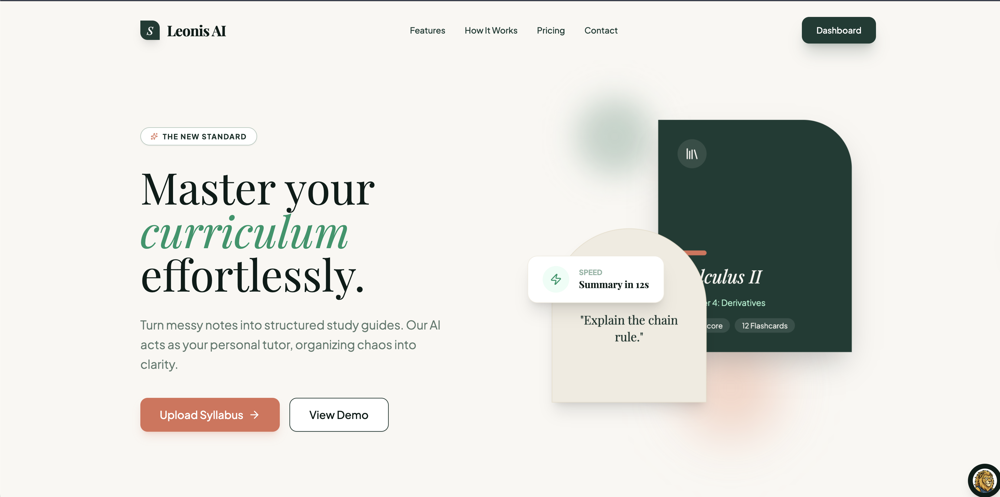
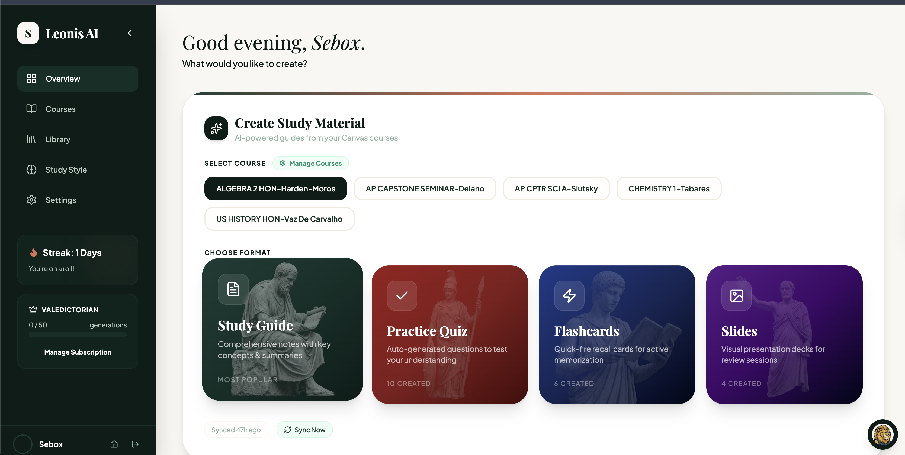
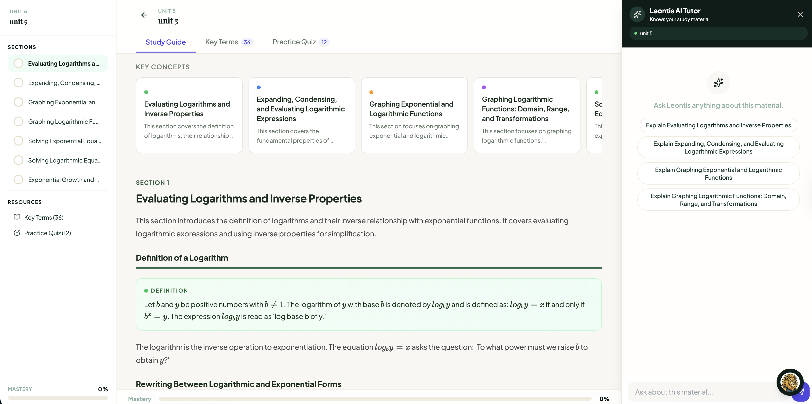
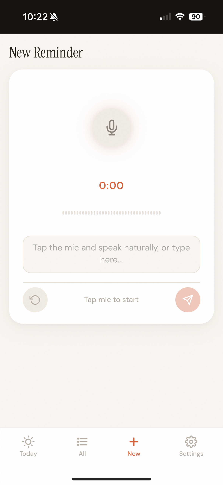
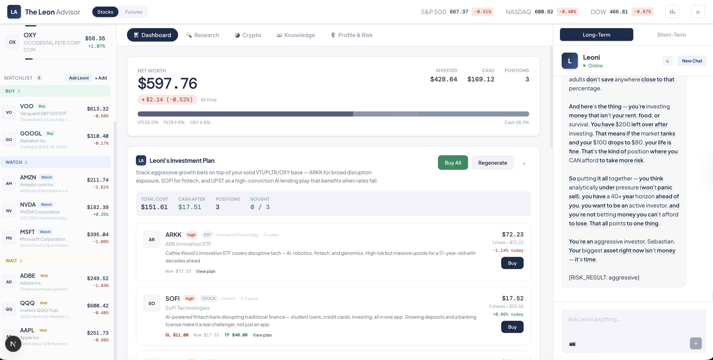

### Hey, I'm Sebastian

I'm a high school junior who's genuinely into all of it — cybersecurity, computer science, computer engineering, anything under the tech umbrella. Right now I'm exploring all of these pathways so I can figure out where I want to go deep.

I like to build before I learn — there's no reason to sit around waiting. Innovating with AI has introduced me to concepts a regular CS student would have waited years to touch. By leveraging AI as my assistant, I've been able to create even when I barely know the underlying theory. Why wait to learn when you can learn as you create?

Everything here is something I've shipped, launched, or actively maintain.

---

### What I've Built

#### [Focus Grade Calculator](https://chromewebstore.google.com/detail/focus-grade-calculator/kgmcmnipeaiklodeglhndfiniojdaggo)

Chrome extension that lets students simulate hypothetical assignments and instantly see the impact on their grade. Supports weighted/unweighted grading, GPA projection, multiple themes, and undo/redo — all running 100% locally in the browser.

`Chrome Extension` `Vanilla JS` `Manifest V3`

  
  

  
  

---

#### [leonis.study](https://leonis.study)

AI-powered study platform that syncs with your school's Canvas LMS, pulls in all your course materials, and generates study guides, quizzes, and flashcards using AI. Includes an AI tutor, real-time sync, and Stripe-powered subscriptions.

`React` `TypeScript` `Supabase` `Gemini AI` `Stripe`

  

  
  

---

#### [Reminders](https://github.com/SebastianLeonD/reminderapp)

Voice-first, AI-powered reminder app. Speak naturally and AI handles categories, priorities, timing, and alert schedules. Built with a simple stack — FastAPI backend, single-file PWA frontend, SQLite storage, and Gemini for natural language parsing.

`Python` `FastAPI` `SQLite` `Gemini AI` `PWA`

  
  
  

---

#### The Leon Advisor

AI-powered personal financial adviser. Helps users manage and understand their finances through intelligent conversations and data-driven insights.

`Next.js` `TypeScript` `Prisma` `AI`

  

---

#### JavaVision

Browser-based Java IDE built for students. Write Java code and visualize exactly what it does — step through execution, see the stack and heap in real time, and get AI-powered explanations. Designed to make abstract CS concepts tangible.

`Next.js` `TypeScript` `Monaco Editor` `Gemini AI` `Docker`

---

#### AI Study Helper

Chrome extension that puts an AI assistant right in your browser. Highlight text to get explanations, take screenshots for AI analysis, and chat with an AI tutor from any webpage — including built-in support for Canvas LMS quizzes.

`Chrome Extension` `Vanilla JS` `Gemini AI` `Manifest V3`

---

### Tech I've Worked With

